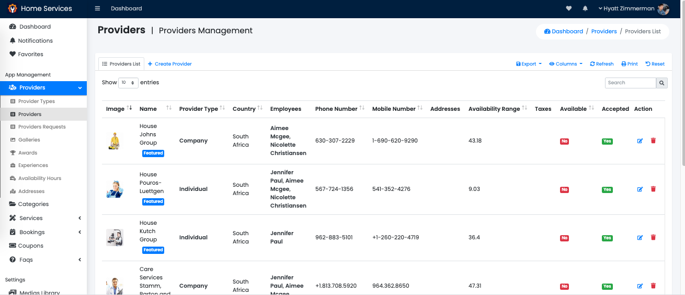
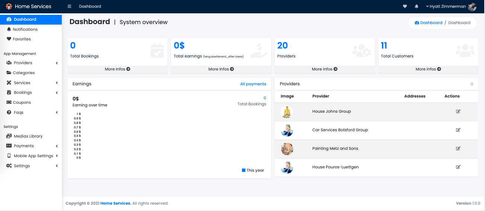
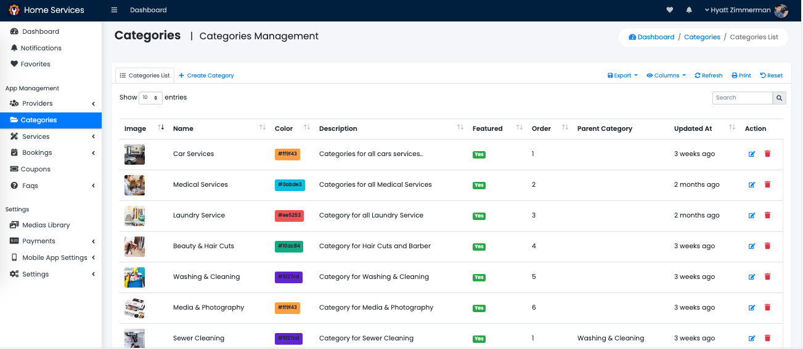
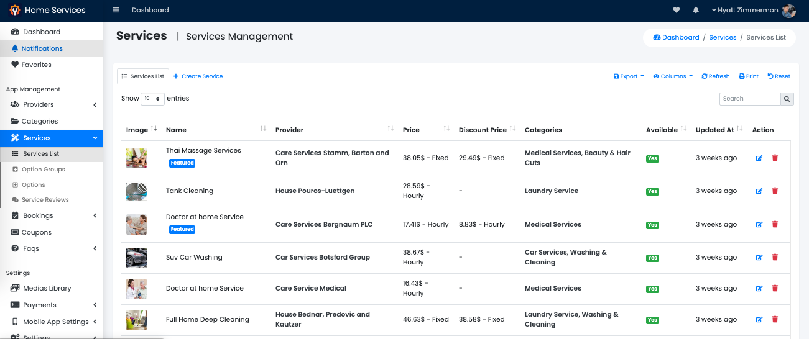

# Home-Service_Flutter

The app	should	have	the	capability	to	handle	more	than	52 services	including	all	on	demand	services	like	doctors,	beauticians,	fitness	
coaches,	carpenters,	lawyers,	plumbers,	maids,	massage	therapists,	lawn mowers	and	etc.	With	all	the	services	integrated	under	a	single	platform,	users	
will	find	this	app	an	elixir	in	this	world	of	limited memory	space	and	unlimited	apps	to	download.	Empower	your	next	multi-service	providing	
business	with	our	on	demand	handyman	services	app	development	solutions.

## Screenshot

|                Screenshot               | Screenshot |
|:---------------------------------------:|:-------------------------------------:|
|    |      |

|                Screenshot               | Screenshot |
|:---------------------------------------:|:-------------------------------------:|
|    |      |

|                Screenshot               | Screenshot |
|:---------------------------------------:|:-------------------------------------:|
|    |      |
